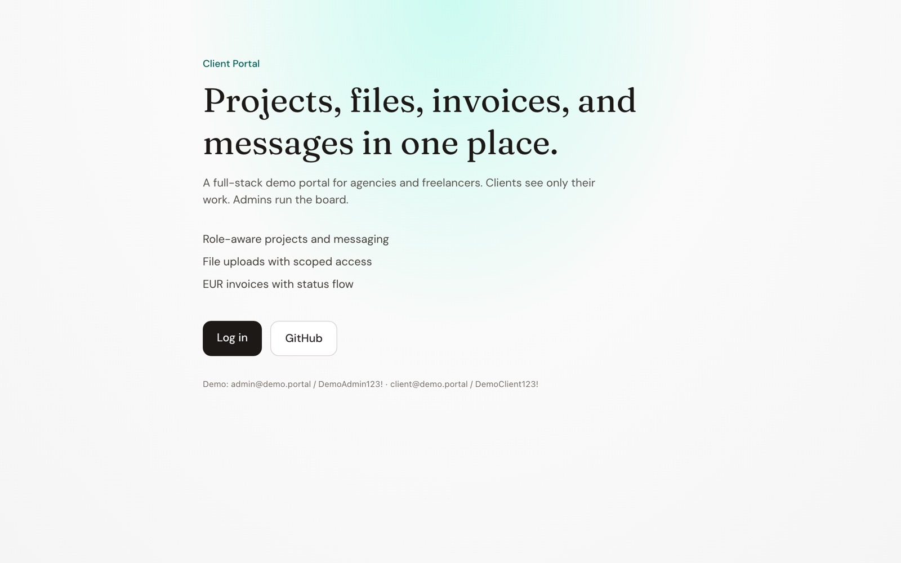
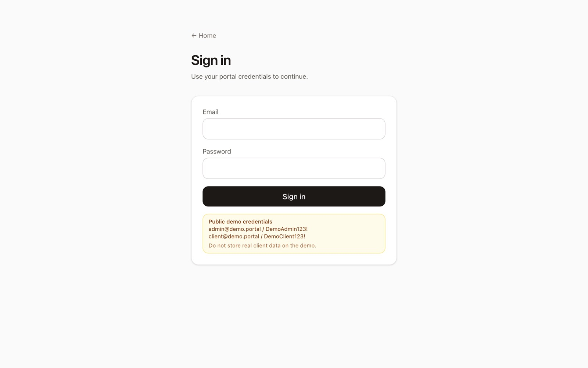
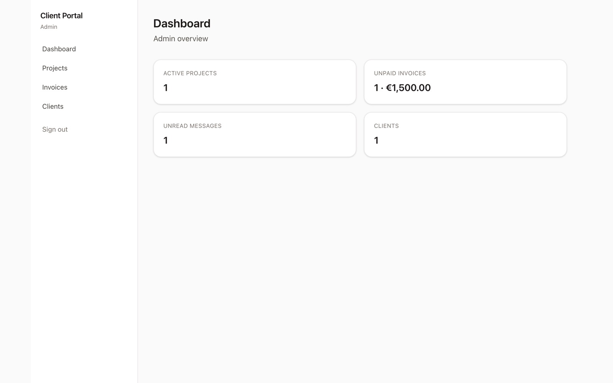
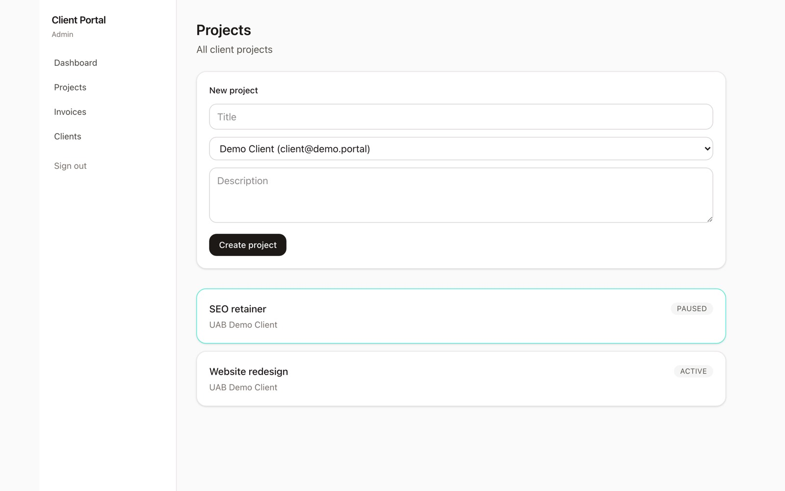
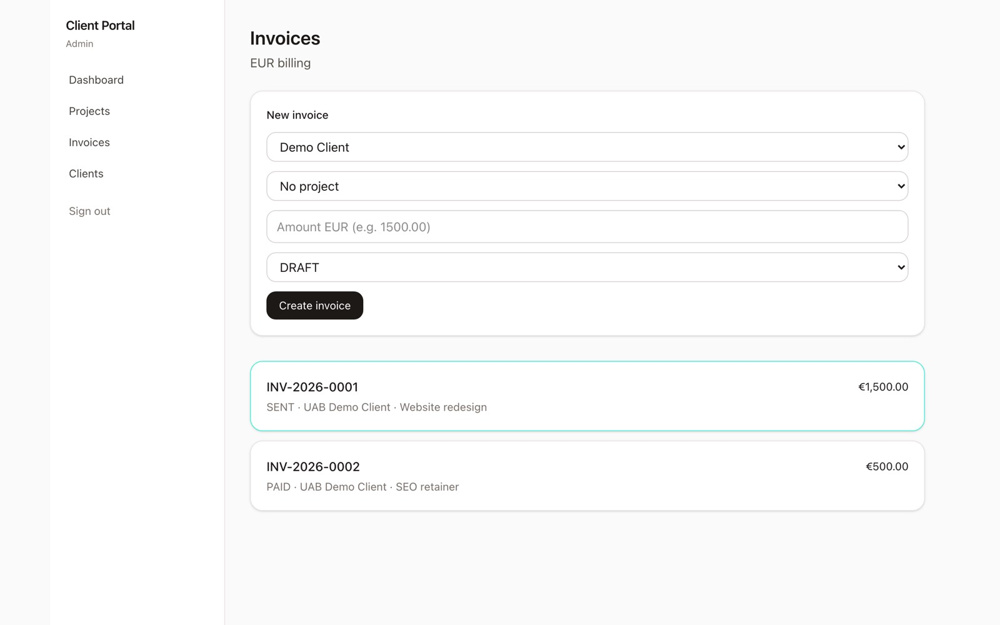

# Client Portal

Full-stack portal for agencies and freelancers: **projects, files, invoices, and messages** with admin/client roles.

**Live demo:** [https://client-portal-zeta-rust.vercel.app](https://client-portal-zeta-rust.vercel.app)











## Features

- Credentials auth (Auth.js) with login rate limiting
- Admin and client role isolation (IDOR → 404)
- Projects, message threads, file uploads
- EUR invoices with atomic `INV-YYYY-####` numbers
- Admin can create client users
- Demo seed data

## Stack

Next.js (App Router) · TypeScript · Prisma · PostgreSQL (Neon) · Auth.js · Zod · Vitest · Tailwind · Vercel Blob

## Quick start

### 1. Postgres

Use Neon, Docker, or the embedded helper:

```bash
npm install
npm run db:pg
# in another terminal, copy the printed DATABASE_URL into .env
```

### 2. Env

```bash
cp .env.example .env
# set DATABASE_URL, AUTH_SECRET (32+ chars)
```

### 3. Migrate + seed

```bash
npx prisma migrate dev
npm run db:seed
npm run dev
```

Open http://localhost:3000

### Demo users

| Role | Email | Password |
|------|-------|----------|
| Admin | admin@demo.portal | DemoAdmin123! |
| Client | client@demo.portal | DemoClient123! |

Public demo credentials are for showcase only. Do not store real client data.

## Scripts

- `npm run dev` – app
- `npm run db:pg` – embedded Postgres (local)
- `npm run db:seed` – seed demo
- `npm test` – unit + authz tests
- `npm run build` – production build

## Architecture

```mermaid
erDiagram
  User ||--o| ClientProfile
  User ||--o{ Project : client
  Project ||--o{ FileAsset
  Project ||--o{ Message
  User ||--o{ Invoice : client
  Project ||--o{ Invoice
```

## Limits (MVP)

- No password reset / OAuth
- No edit/delete messages
- No server-generated PDF (browser print)
- No email notifications
- Local disk storage in development only; production requires Vercel Blob
- Postgres only (no SQLite)

## License

MIT
